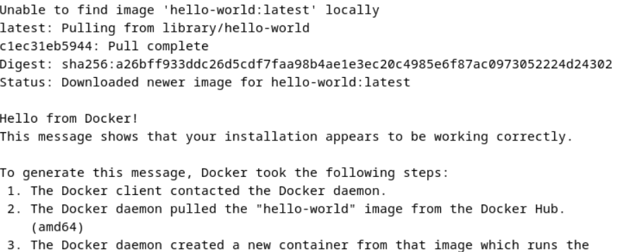
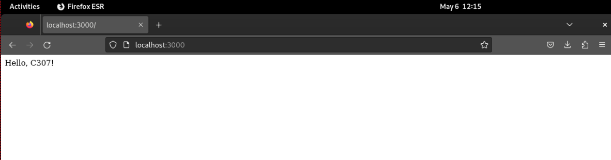

`Tugas ini merupakan tugas mata kuliah Konsep Jaringan yang dibimbing oleh Bpk. Dr. Ferry Astika Saputra,ST, M.Sc`

## Table of Contents
- [Docker Install](#install-docker-engine-debian-12)
- [Docker Simple Task](#docker-simple-project)

- # _INSTALL DOCKER ENGINE DEBIAN 12_

## - MENGHAPUS VERSI LAMA (Jika sebelumnya pernah memasang)

- Ketik `for pkg in docker.io docker-doc docker-compose podman-docker containerd runc; do sudo apt-get remove $pkg; done`:
  
      

## - INSTALL DENGAN REPOSITORI APT

- Masukkan command berikut ini:
  - `sudo apt-get update`:
  - `sudo apt-get install ca-certificates curl`:
  - `sudo install -m 0755 -d /etc/apt/keyrings`:
  - `sudo curl -fsSL https://download.docker.com/linux/debian/gpg -o /etc/apt/keyrings/docker.asc`:
  - `sudo chmod a+r /etc/apt/keyrings/docker.asc`:
  - `echo \
  "deb [arch=$(dpkg --print-architecture) signed-by=/etc/apt/keyrings/docker.asc] https://download.docker.com/linux/debian \
  $(. /etc/os-release && echo "$VERSION_CODENAME") stable" | \
  sudo tee /etc/apt/sources.list.d/docker.list > /dev/null`:

  
## - INSTALL PAKET DOCKER

- Untuk memasang paket versi terbaru gunakan perintah ini:
  - `sudo apt-get install docker-ce docker-ce-cli containerd.io docker-buildx-plugin docker-compose-plugin`:
    
    
    
- Cek versi Docker:
  - `docker --version`:
    

## - VERIFIKASI

- Untuk memverifikasi bahwa penginstalan berhasil gunakan perintah:
  - `sudo docker run hello-world`:
    
      

# _DOCKER SIMPLE PROJECT_

## - CLONE PROJECT

- Lakukan git clone dari project docker-example: 
  - `git clone https://github.com/alfiyansys/docker-examples.git`
  
## - BUAT IMAGE DOCKER

- Masuk ke direktori docker-example:
  - `cd docker-examples`

- Membuat sebuah image Docker dari sebuah Dockerfile yang ada di direktori saat ini :
  - `sudo docker build -t example .`

     

## - MENJALANKAN DOCKER

- Jalankan sebuah container Docker dari sebuah image yang sudah ada:
  - `sudo docker run -p 3000:80 example`

      
    
- Jalankan pada firefox dengan mengetikkan:
  - `localhost:3000`
    
    