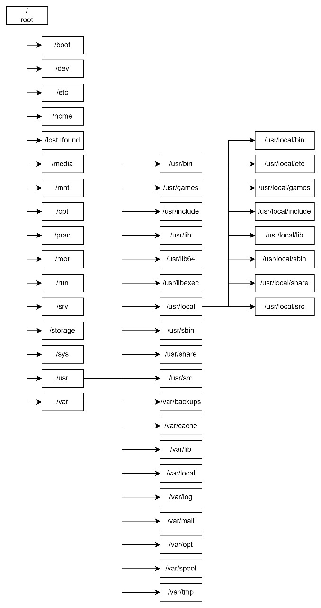

`Tugas ini merupakan tugas mata kuliah Konsep Jaringan yang dibimbing oleh Bpk. Dr. Ferry Astika Saputra,ST, M.Sc`

# Debian Directory

Penjelasan :

- `/boot`: Direktori ini berisi file yang diperlukan untuk proses booting sistem, termasuk kernel dan konfigurasi bootloader.

- `/dev:` Direktori ini berisi file khusus (device files) yang merepresentasikan perangkat keras atau virtual di sistem, seperti /dev/sda untuk hard drive atau /dev/tty1 untuk terminal.

- `/etc:` Direktori konfigurasi sistem. File konfigurasi untuk berbagai program dan layanan disimpan di sini. Misalnya, /etc/network untuk konfigurasi jaringan.

- `/home`: Direktori ini berisi folder pribadi untuk setiap pengguna. Setiap pengguna memiliki folder sendiri di sini, seperti /home/username.

- `/lost+found`: Direktori ini digunakan oleh sistem file untuk menyimpan file yang terfragmentasi atau rusak saat proses pemulihan setelah crash.

- `/media`: Direktori ini digunakan untuk sementara me-mount perangkat penyimpanan eksternal seperti USB drive atau CD-ROM.

- `/mnt`: Direktori ini sering digunakan untuk me-mount sementara sistem file lain atau perangkat penyimpanan eksternal. Namun, /mnt lebih umum digunakan untuk mount manual, sementara /media lebih sering digunakan oleh sistem secara otomatis.

- `/opt`: Direktori ini biasanya digunakan untuk menginstal perangkat lunak tambahan (optional). Program atau paket yang diinstal di sini seringkali tidak tergantung pada sistem secara langsung.

- `/root`: Ini adalah direktori home untuk pengguna root, atau administrator sistem. File konfigurasi pribadi root dan file yang terkait dengan root umumnya disimpan di sini.

- `/run`: Direktori ini berisi file dan direktori sementara yang dihasilkan oleh sistem pada saat boot atau runtime. Contohnya adalah file pid (process ID) dan socket.

- `/srv`: Direktori ini sering digunakan untuk menyimpan data yang disajikan oleh server, seperti file web yang dapat diakses melalui HTTP.

- `/storage`: Direktori kustom yang dibuat saat partition.

- `/sys`: Direktori ini memberikan antarmuka ke parameter dan statistik kernel. Ini adalah bagian dari sistem file virtual yang memberikan informasi tentang konfigurasi dan status kernel.

- `/usr`: Direktori ini berisi sebagian besar program, library, dan dokumen sistem. Struktur dalam /usr biasanya mirip dengan struktur sistem file root (/), tetapi lebih terorganisir untuk menyimpan file biner dan sumber daya aplikasi.

- `/var`: Direktori ini berisi data variabel, termasuk log file, cache, dan file yang dapat berubah ukuran (seperti file database). Ini sering digunakan untuk data yang berubah selama runtime sistem.
