# **Dasar Sistem Administrasi**

    NRP   : 3122600012
    Nama  : Mahargi Anugerahwan Pamungkas
    Kelas : 2 D4 IT A
    Dosen : Dr. Ferry Astika Saputra, ST, M.Sc

---

# Discover: the KDE Package Manager

Gnome menggunakan software untuk me-manage aplikasi dengan cara sederhana, yaitu "Discover".

Discover dapat membantu kita untuk search, remove, atau update aplikasi kita dari satu interface. Kita juga dapat memodifikasi software source kita. (Secara mudah, Discover bekerja seperti Play Store)

Untuk membuka Discover, cukup masuk ke main menu > Application > System > Software Center > Discover

---

# Discovery Interface

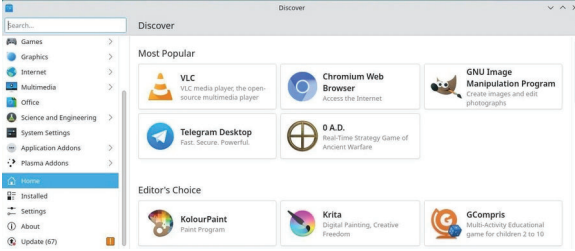

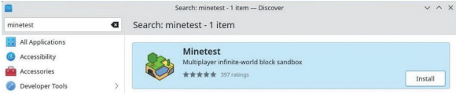

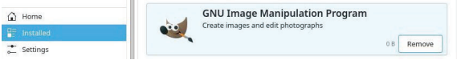

---

# Discovery Interface

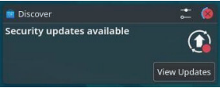

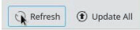

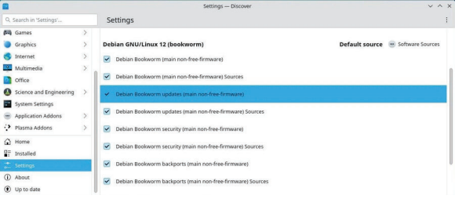

---

# Synaptic: the Comprehensive Package Manager

Synaptic adalah comprehensive graphical interface milik debian package manager

Ini memungkinkan untuk melihat total dari packages yang dipilih, baik terinstall maupun yang belum. Ini jauh lebih detail darpiada Discovery karena Synaptic menampilkan set lengkap packages yang tersedia. (termasuk libraries-nya)

---

# Synaptic Interface

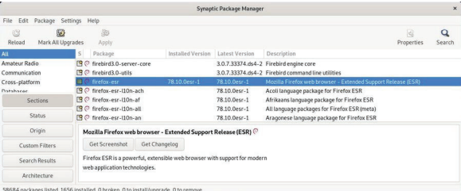

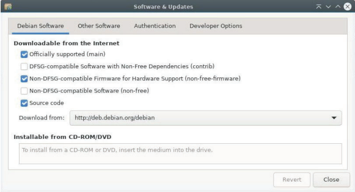

---

# Synaptic Interface

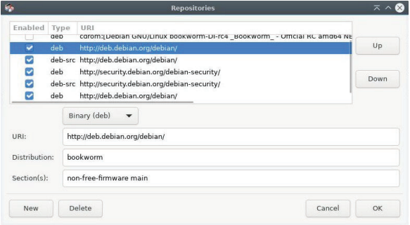

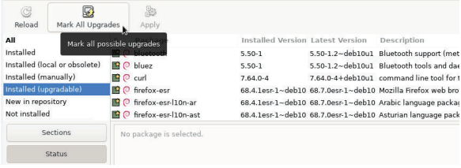

---

# Synaptic Interface

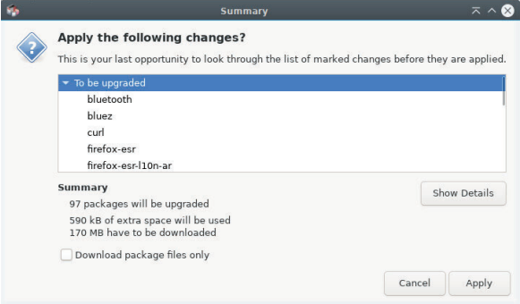

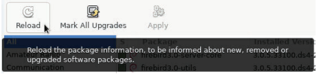

---

# Cleaning the System

Sebelum ke bagian cleaning, terdapat beberapa tools untuk mengetahui ruang yang digunakan dalam disk.

Kita bisa menggunakan terminal dengan `df -h` atau Disk Usage Analytics, application langsung dari debian.

---

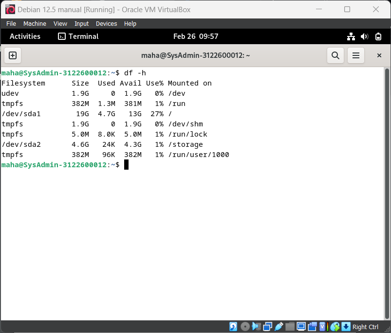

---

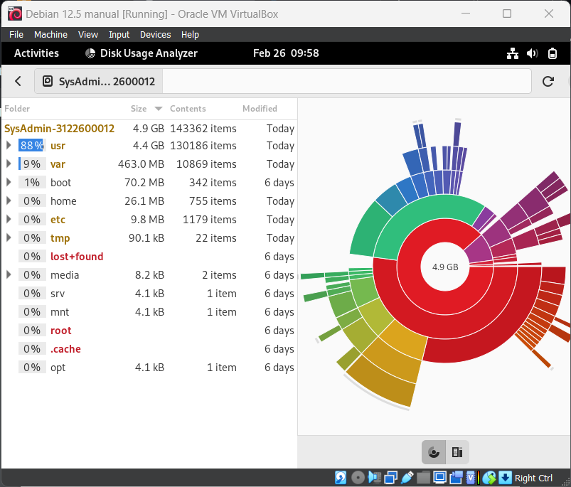

---

# Cleaning Procedures

Untuk membersihkan disk kita, kita akan memulai dari langkah pertama, yaitu:

## Cleaning the Packages :
using terminal

`apt clean`
`apt autoremove --purge`
`aot list ?obsolete`
`apt remove '?obsolete`

---

# Cleaning Procedures

## Emptying the Trash Bins :
using terminal

`rm -Rf ~/.local/share/Trash/*` > user wastebasket
`rm -Rf /root/.local/share/Trash/*` > admin wastebasket
`/media/your_id/your_disk/.Trash_1000` > external wastebasket

---

# Cleaning Procedures

## Purging Application Caches :
using terminal
`rm -Rm ~/.cache/*`

## Purging the thumbnails :
using terminals
`rm -Rf ~/.thumbnails`

---