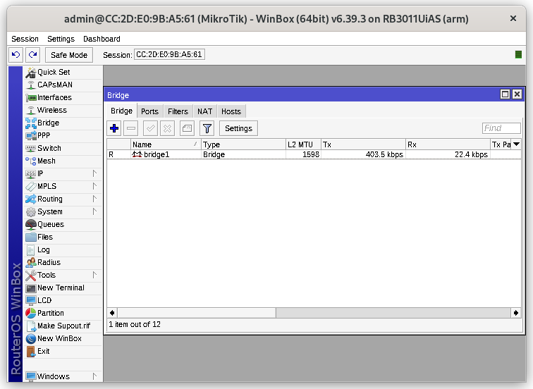
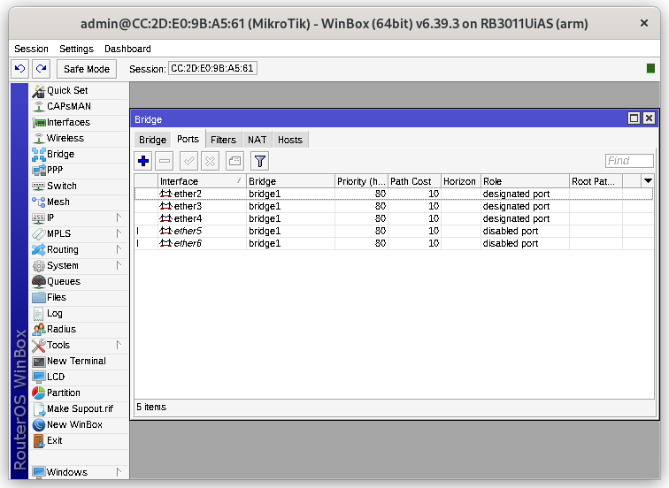
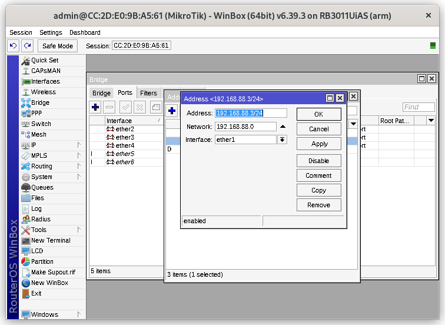
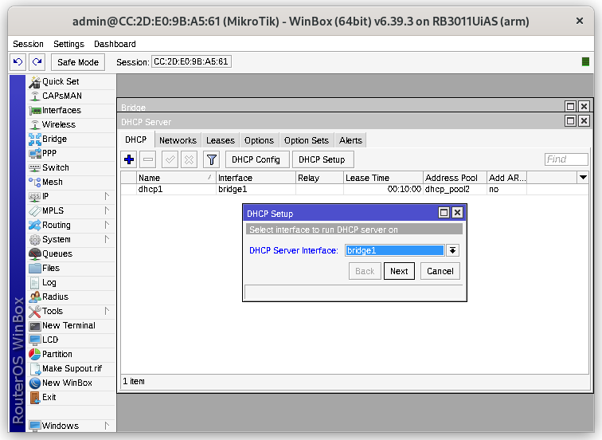
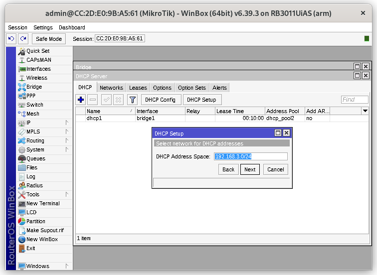
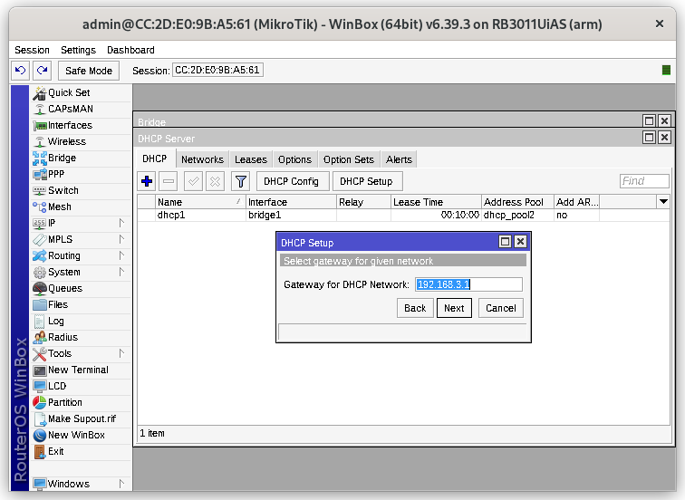
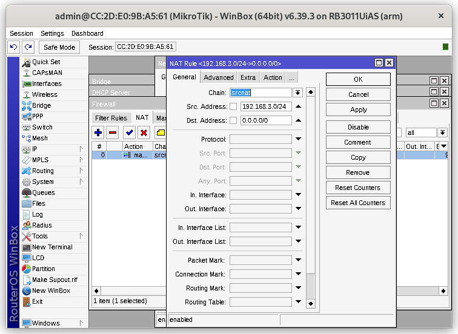
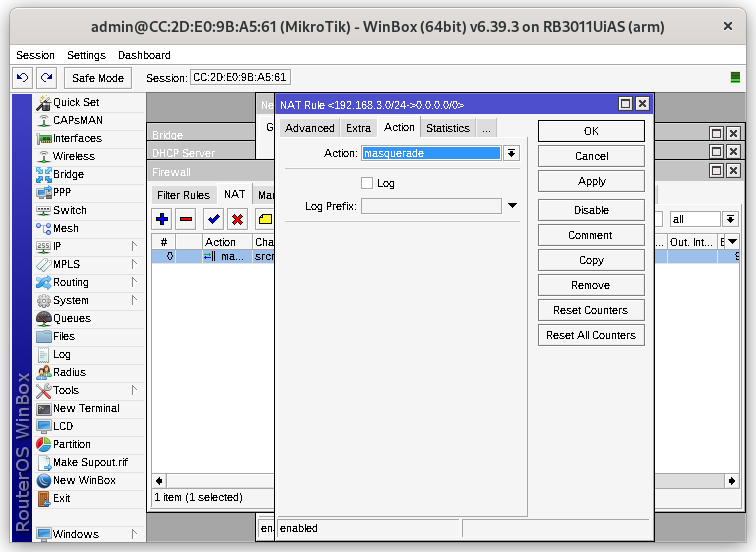

`Tugas ini merupakan tugas mata kuliah Konsep Jaringan yang dibimbing oleh Bpk. Dr. Ferry Astika Saputra,ST, M.Sc`

## Table of Contents
- [Winbox Settings](#menyetting-winbox-step-by-step)

# Menyetting Winbox Step-by-Step

- Klik menu Bridge dan buat bridge baru pada kolom Bridge

- Masih di menu Bridge, pilih kolom Ports dan buat port ether 2 - 10

- Pilih menu IP dan klik menu Addresses untuk membuat address list baru. Buat address baru untuk interface bridge1 dan ether1.

- Pilih menu IP dan klik menu DHCP Server. Lalu klik DHCP Setup dan masukkan dengan ketentuan berikut :

1. DHCP Server Interface = bridge1
2. DHCP Address Space = 192.168.3.0/24
3. Gateway for DHCP Network = 192.168.3.1
4. Addresses to Give Out = 192.168.88.100 - 192.168.88.200
5. DNS = 202.9.85.3

- Pilih menu Routing dan klik menu Firewall. Pilih kolom NAT dan kita tambahkan NAT baru dengan :

1. Src. Address = 192.168.3.0/24
2. Dst. Address = 0.0.0.0/0

- Klik menu Action dan pilih masquerade dan klik OK untuk menyimpan.

