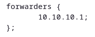

`Tugas ini merupakan tugas mata kuliah Konsep Jaringan yang dibimbing oleh Bpk. Dr. Ferry Astika Saputra,ST, M.Sc`

## Table of Contents
- [DNS Setup](#dns-setup)
- [Sending Email](#sending-email)

# DNS Setup Kelompok 3

`path: /etc/bind/...`

## named.conf

## named.conf.local

## named.conf.options

`path: /var/lib/bind/...`

## db.kelompok3.local

## db.kelompok3.local.inv

`path: /etc/...`

## resolv.conf
 

## Setting connection profile

 

# Sending Email

## To ourselves

1. Open _Evolution_ in the Menu.
2. Create a new account with the address is your ip. (192.168.3.10)
3. Setting your profile. (Full name, email, etc)
4. Open cmd and type `sudo telnet mail.kelompok3.local 25`
5. Send an email to yourself in the Evolution app.
6. Done.